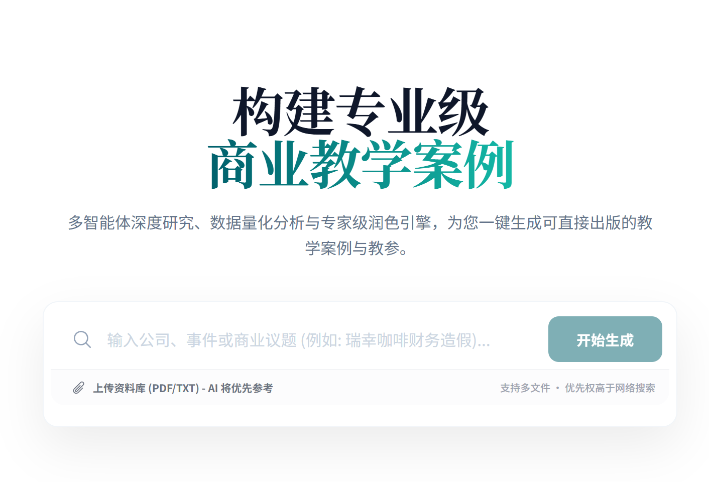

# BizCase Pro

## Overview

BizCase Pro is an advanced AI-powered engine designed to generate professional Business School Case Studies and Teaching Notes. It leverages multi-agent workflows to conduct deep research, structure narrative frameworks, and draft comprehensive educational materials suitable for academic environments.

## Core Capabilities

*   **Deep Research**: Aggregates information from global sources, financial reports, and uploaded internal documents to build a factual ground truth.
*   **Strategic Frameworks**: Architectures case narratives with conflict, decision points, and quantitative backing.
*   **Drafting & Polishing**: Produces high-quality, objective narratives and structured teaching guides.
*   **Visual Analysis**: Automatically identifies data points and constructs Markdown tables for financial and market analysis.
*   **Safety & Compliance**: Includes a manual "Firewall Check" to audit content for formatting, objectivity, and visual consistency before export.

## How to Use

1.  **Initialize**: Launch the application and enter your Google Gemini API Key. The key is stored locally in your browser for security.
2.  **Define Topic**: Enter a company name, event, or specific business dilemma (e.g., "Luckin Coffee Financial Fraud").
3.  **Upload Context (Optional)**: Attach PDF or text files to serve as the primary source of truth for the case.
4.  **Select Objectives**: Choose or refine the specific learning goals for the case.
5.  **Review Framework**: Approve the generated outline or request adjustments to the narrative arc.
6.  **Generate & Refine**: The system writes the full case and teaching notes. Use the "Copilot" feature to make granular edits or the "Check" button to run a final quality assurance pass.
7.  **Export**: Download the final documents as PDF.

## Deployment

This project is optimized for deployment on Vercel.

1.  Push this repository to GitHub.
2.  Import the project into Vercel.
3.  The build settings (Vite) will be detected automatically.
4.  No environment variables are required on the server side; API keys are client-side only.

## Privacy

*   API Keys are never sent to our servers; they are used directly from the client browser to the Google Gemini API.
*   All research and generation happen in real-time.